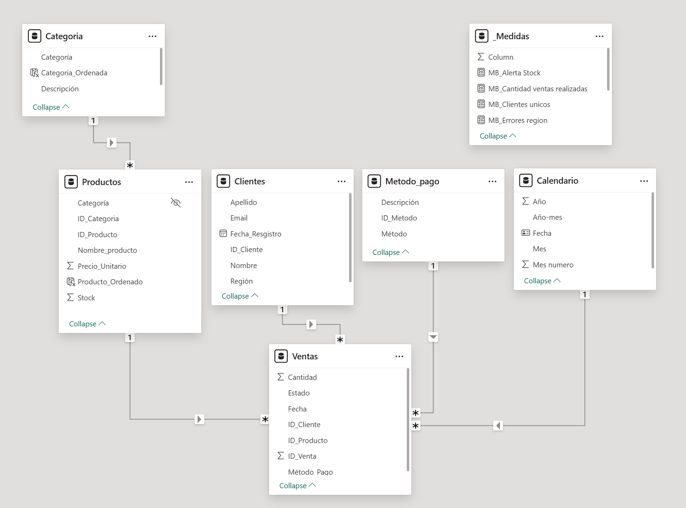
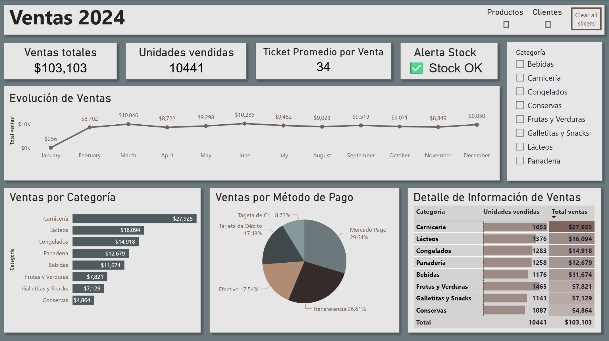
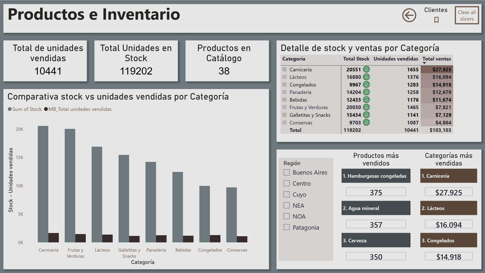
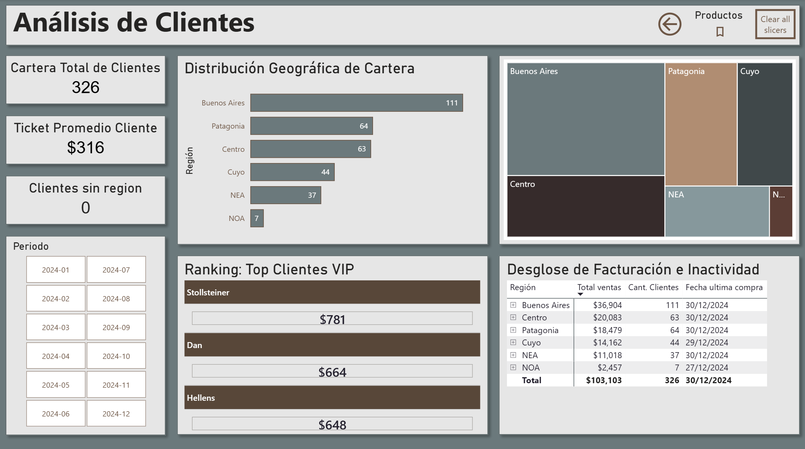

# Análisis de Datos de Ventas con SQL y Power BI
Este proyecto tiene como objetivo diseñar, construir y analizar una base de datos relacional utilizando **SQL** y posteriormente visualizar los insights obtenidos mediante **dashboards interactivos en Power BI**.

Se trabajó un dataset de **ventas minoristas (supermercado)** desarrollando un proceso completo que incluye:

* Modelado de datos y creación de tablas

* Proceso ETL para carga, limpieza y transformación de datos

* Análisis exploratorio mediante consultas SQL

* Generación de métricas clave para el negocio

* Visualización y storytelling con Power BI

Buscando **demostrar habilidades técnicas en SQL**, buenas prácticas de modelado y **capacidad analítica para extraer información relevante del negocio**.


## Herramientas utilizadas
- **MySQL 8**: Diseño, creación y análisis de la base de datos relacional. Desarrollo de consultas para análisis exploratorio y generación de métricas.
- **Visual Studio Code + SQLTools**: Ejecución, validación y organización de consultas SQL.
- **Power BI**: Modelado de datos y visualización de insights a partir de la base construida en SQL.
- **Power Query**: Transformaciones menores y ajustes de datos para su correcta visualización.
- **DAX**: Creación de medidas básicas y tabla calendario.
- **Git & GitHub**: Control de versiones y documentación del proyecto.
- **Archivos CSV**: Fuente de datos inicial.


## Origen y modelado de datos
Los datos utilizados en este proyecto provienen de "Datasets para Proyecto BI - Análisis de Ventas", disponible en Kaggle en formato CSV y públicamente en el siguiente enlace:

https://www.kaggle.com/datasets/dataregina/datasets-para-proyecto-bi

El dataset incluye información de:
- Clientes
- Productos
- Categorías
- Ventas
- Métodos de pago

A partir de estos datos se construyó un **modelo relacional** que incluye las siguientes tablas y relaciones, garantizando **integridad y trazabilidad** de la información:

**Tablas principales:**
- Clientes
- Producto
- Categorias
- Metodo_pago
- Ventas

**Relaciones entre tablas:**
```
- Ventas.ID_Cliente → Clientes.ID_Cliente
- Ventas.ID_Producto → Producto.ID_Producto
- Producto.ID_Categoria → Categorias.ID_Categoria
- Ventas.Metodo_Pago → Metodo_pago.ID_Metodo
```

Permitiendo analizar ventas, clientes y productos de manera consistente, y sirviendo como base para la creación de métricas y dashboards en Power BI.


## Desarrollo y análisis del proyecto

Se realizó un flujo completo de trabajo en **SQL**, desde el modelado inicial hasta la generación de insights finales para el negocio. Las principales etapas fueron:

1. Modelado y construcción de la base de datos

    - Diseño del modelo relacional a partir de archivos CSV.

    - Creación de tablas normalizadas (Clientes, Producto, Categorías, Método de pago, Ventas).

    - Implementación de claves primarias y foráneas para asegurar integridad referencial.

    - Incorporación de la columna ID_Categoria en Producto y posterior asignación mediante JOIN con Categorías.

2. Proceso ETL (carga, limpieza y validación)

    - Carga de datos con LOAD DATA INFILE desde archivos CSV.

    - Conversión y validación de fechas.

    - Eliminación automática de registros duplicados mediante IGNORE.

    - Normalización de categorías, productos y métodos de pago.

    - Verificación de consistencia entre claves foráneas y datos importados.

3. Análisis exploratorio de los datos

    Se desarrollaron consultas de exploración para comprender el comportamiento del dataset:

    - Clientes por región.

    - Stock total y cantidad de productos por categoría.

    - Distribución de ventas por método de pago.

    - Evolución mensual de ventas.

4. Métricas clave del negocio

    Se calcularon indicadores fundamentales para retail:

    - Top categorías más vendidas.

    - Top productos por cantidad y revenue.

    - Clientes con mayor volumen de compras.

    - Meses con mayor facturación.

    - Relación stock vs ventas para anticipar quiebres de inventario.

5. Controles de calidad y detección de incidencias

    Con el objetivo de simular escenarios reales del negocio, se agregaron consultas para detectar problemas frecuentes en bases de datos operativas:

    - Productos con bajo stock.

    - Ventas duplicadas.

    - Precios incorrectos o valores nulos.

    - Métodos de pago no válidos.

    - Productos sin categoría asignada.

    - Ventas realizadas con stock insuficiente.

6. Visualización en Power BI

    Se desarrollaron tres dashboards interactivos que permiten explorar la información mediante filtros por fecha, categoría y región:

    - Ventas 2024
        * KPIs principales
        * Evolución mensual
        * Ventas por categoría
        * Ventas por método de pago
        * Alertas de stock

    - Productos e Inventario
        * Comparativa stock vs unidades vendidas
        * Productos más vendidos
        * Categoría más vendidos
        * Productos en catálogo
        * Stock total

    - Análisis de Clientes
        * Distribución geográfica
        * Ticket promedio por cliente
        * Ranking de clientes VIP
        * Facturación e inactividad
        * Cartera total de clientes

## Modelado, métricas y KPIs en Power BI

A partir del modelo relacional construido en SQL, y con el objetivo de visualizar los resultados obtenidos, se desarrollaron dashboards en Power BI. Para ello, se crearon diversas **medidas DAX** orientadas a generar indicadores clave del negocio.

### Modelado de datos

Se implementó un esquema tipo estrella, donde la tabla de hechos **Ventas** se relaciona con las tablas de dimensiones **Productos**, **Clientes**, **Categoría**, **Calendario** y **Método de Pago**.
Este enfoque permite un correcto flujo de filtros, mejor rendimiento del modelo y mayor claridad analítica.



### Página: Ventas 2024 
Métricas orientadas a analizar el volumen de ventas, facturación y comportamiento general del negocio.


**1. MB_Cantidad ventas realizadas**: Cuenta el total de ventas registradas

```
        MB_Cantidad ventas realizadas =
        COUNT ( Ventas[ID_Venta] )     
```

**2. MB_Total ventas**: Calcula el revenue total del periodo (Cantidad * Precio Unitario)

```
        MB_Total ventas =
        SUMX ( Ventas, Ventas[Cantidad] * RELATED ( Productos[Precio_Unitario] ) )
```

**3. MD_Ticket promedio ventas**: Calcula el ticket promedio por venta (total ventas / cantidad de ventas realizadas).  

```
        MD_Ticket promedio ventas =
        DIVIDE ( [MB_Total ventas], [MB_Cantidad ventas realizadas] )
```
**4. MB_Alerta Stock**: Identifica productos con stock menor a 10 unidades.  

```
        MB_Alerta Stock =
        VAR ProductosBajos =
            COUNTROWS ( FILTER ( Productos, Productos[Stock] < 10 ) )
        RETURN
            IF (
                ProductosBajos > 0,
                "⚠️ " & ProductosBajos & " Prod. con Stock Bajo",
                "✅ Stock OK"
            )
```
### Página: Productos e Inventario
Métricas enfocadas en el control de stock, volumen de productos vendidos y alertas de inventario.


**1. MB_Total unidades vendidas**: Suma la cantidad total de productos vendidos.  

```
        MB_Total unidades vendidas =
        SUM(Ventas[Cantidad])
```
 

### Página: Análisis de Clientes
Indicadores relacionados con el comportamiento de los clientes y calidad de los datos.


**1. MB_Clientes únicos**:Cuenta la cantidad de clientes distintos que realizaron compras.  

```
        MB_Clientes únicos =
        DISTINCTCOUNT ( Ventas[ID_Cliente] )
```

**2. MD_Ticket promedio cliente**: Calcula el ticket promedio por cliente (total ventas / clientes únicos).  

```
        MD_Ticket promedio cliente =
        DIVIDE ( [MB_Total ventas], [MB_Clientes únicos] )
```

**3.MB_Errores región**: Cuenta clientes con fecha de registro vacía o sin región asignada, permitiendo detectar errores en la base de datos de clientes.  

```
        MB_Errores región =
        COUNTROWS (
            FILTER (
                Clientes,
                ISBLANK ( Clientes[Fecha_Registro] ) || Clientes[Región] = ""
            )
        ) + 0
```

### Tabla Calendario  
Genera un calendario dinámico con columnas de año, mes, nombre de mes y año-mes, permitiendo filtrar y analizar información temporal en los dashboards.
```
Calendario =
        ADDCOLUMNS (
            CALENDAR ( MIN ( Ventas[Fecha] ), MAX ( Ventas[Fecha] ) ),
            "Año", YEAR ( [Date] ),
            "Mes numero", MONTH ( [Date] ),
            "Mes", FORMAT ( [Date], "MMMM" ),
            "Año-mes", FORMAT ( [Date], "YYYY-MM" )
        )
```
## Demo del Dashboard

Video demostrativo de la navegación por los dashboards interactivos desarrollados en Power BI, incluyendo el uso de filtros y botones por página.

[Ver video demo del dashboard](demo/ProyectoPBI.mp4)


## Información relevante obtenida 
1. Categorías más vendidas:
Las categorías con mayor volumen de ventas fueron Carnicería, Lácteos y Congelados.

    *Acción sugerida*: utilizar estas categorías como impulso para aumentar la rotación de categorías con menor demanda mediante promociones cruzadas o descuentos combinados.

2. Productos con mayor demanda:
Los productos más vendidos fueron Hamburguesas congeladas, Agua mineral y Cervezas.

    *Acción sugerida: establecer controles más estrictos de stock para estos productos, asegurando niveles mínimos para evitar quiebres durante picos de demanda.

3. Clientes de alto valor:
Los clientes con mayor volumen de compras fueron Stollsteiner Pinchas, Dan Judah y Hellens Eben.

    *Acción sugerida*: implementar estrategias de retención y fidelización, como beneficios exclusivos, descuentos personalizados o campañas de marketing directo.

4. Estacionalidad de ventas:
Los meses con mayor facturación fueron junio, marzo y diciembre, lo que revela patrones estacionales en el comportamiento del consumidor.

    *Acción sugerida*: reforzar personal y stock temporal en estos periodos para atender eficientemente la mayor demanda.

5. Gestión de stock y alertas:
El análisis de inventario permitió identificar productos con bajo stock o riesgo de ruptura.

    *Acción sugerida*: implementar alertas automáticas de reposición y revisar la rotación por categoría para optimizar la planificación de compras.

## Conclusiones Finales

Este proyecto permitió transformar datos crudos en información útil para la toma de decisiones.
Gracias al modelado, limpieza y análisis de datos en SQL, y la visualización mediante dashboards en Power BI, se obtuvo conocimiento relevante sobre:

- Comportamiento de clientes y productos

- Estacionalidad de ventas

- Gestión de stock y alertas

En síntesis, el proyecto demuestra la capacidad de extraer insights accionables a partir de datos y de aplicar técnicas de análisis y visualización para soportar decisiones estratégicas del negocio.


